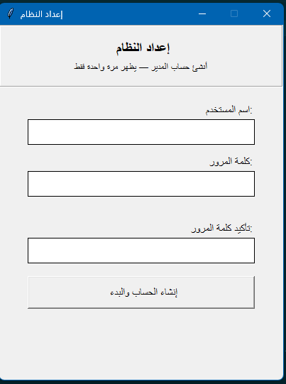

# Python Payroll Management System 💼

A desktop application built with Python, Tkinter, and SQLite for managing employee records, calculating monthly salaries with automated tax/insurance deductions, and generating printable payslips.



## 🌟 Key Features

- **Admin Authentication**: Secure login system with SHA-256 password hashing and a first-run initial setup wizard.
- **Employee Management**:
  - Add, validate, and store employee details with input constraints (ID, Name, Base Salary).
  - Delete employee records from the local database.
  - View full employee directory using an interactive table view (`ttk.Treeview`).
  - Export full employee rosters to `.csv` format.
- **Automated Salary Calculation**:
  - Computes overtime pay based on hourly rate (1.5x multiplier over 176 standard hours).
  - Handles custom bonuses and deductions.
  - Automatically calculates 5% Income Tax and 3% Social Security contributions.
  - Validates entry values to prevent negative or illogical calculations.
- **Itemized Payslip Generation**:
  - Generates detailed payslip summaries showing gross earnings, itemized deductions, and net salary.
  - Export individual payslips directly to `.csv` files.

## 🛠️ Tech Stack

- **Python 3.x** - Core programming language.
- **Tkinter & TTK** - Graphical User Interface (GUI) and themed widgets.
- **SQLite3** - Embedded relational database for persistent local storage.
- **Hashlib** - SHA-256 password security encryption.
- **CSV Engine** - Built-in data export mechanism.

## 🚀 How to Run

### Prerequisites
Make sure you have Python 3 installed on your system. No external `pip` packages are required as all dependencies are built into standard Python.

### Steps

1. **Clone the repository**:
   ```bash
   git clone [https://github.com/namoraomar56-rgb/payroll-management-system.git](https://github.com/namoraomar56-rgb/payroll-management-system.git)
   cd payroll-management-system
